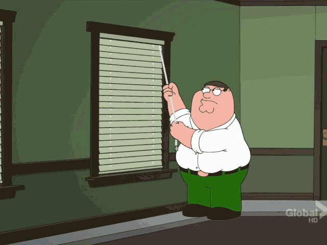

To put it in simple terms: I’ve been wanting to have a blog since very *very* long and now that it finally exists, I am stoked to leave this year on a high note. 

## The Struggle
The blog is powered by Jekyll which I had a hard time setting up on Bash in Windows, so reserving a future post for the same. This pretty much explains what I went through(except the fact that I managed to pull it off): 

## The Motive
The prime motive behind this venture is to document the process of learning and exploring. Expect it to include ideas and opinions on design(typography and prototyping), machine learning(musings about my university project) and programming in general.

## The Catch
Using 26 letters in the alphabet to tell a story is not something as effortless as it seems. So, I ask you to give it a whirl if you don’t already write. Talk about your process or workflow, the scene of city at dawn or anything that interests you. 

Finally, hoping 2017 brings out the best in you and the world.

Here are some reads to begin the year with:  
 - [The Crossroads of Should and Must](https://medium.com/@elleluna/the-crossroads-of-should-and-must-90c75eb7c5b0#.kdjzop9fh)  
 - [It’s Okay to be Dumb](https://dust.bff.co/its-okay-to-be-dumb-d536915238cd#.tq5f90pm6)  
 - [Be Kind](http://briangilham.com/blog/2016/10/10/be-kind) 

 